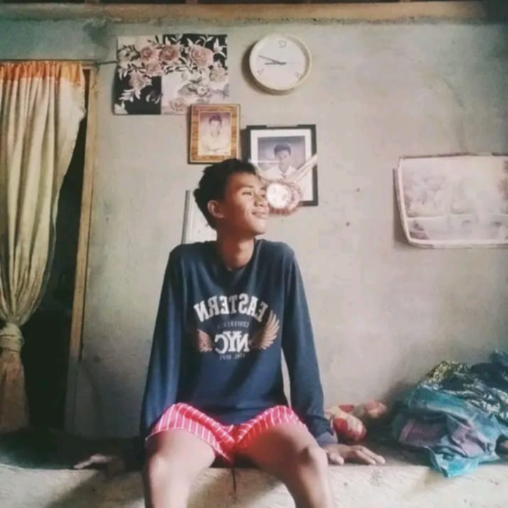

<!DOCTYPE html>
<html lang="en">
<head>
    <meta charset="UTF-8">
    <meta name="viewport" content="width=device-width, initial-scale=1.0">
    <title>Team Slideshow</title>
    
</head>
<body>
    

        

            
            <h2>Daisy A De Asir</h2>
            
Age: 18 | Address: Cogon Lala proper

            
Email: deasirdaisy76@gmail.com

            
<em>"The best way to predict your future is to create it."</em>

        

        

            
            <h2>Crizel Sumalpong Dioquino</h2>
            
Age: 18 | Address: Barangay Rebe LDN

            
Email: 09853143274

            
<em>"Whenever you feel like giving up, look back and see how far you've come."</em>

        

        

            
            <h2>Exequel Bentulan Canoos</h2>
            
Age: 17 | Address: Abaga LDN

            
Email: canoosexequel0@gmail.com

            
<em>"Consciously release the past and choose to live in the present."</em>

        

        

            
            <h2>Ashlee E. Obial</h2>
            
Age: 17 | Address: Cabasagan LDN

            
Email: ashleeobial19@gmail.com

            
<em>"LIVE, LAUGH, and LOVED."</em>

        

        

            
            <h2>Mariane Asumbrado Tejada</h2>
            
Age: 16 | Address: La Libertad Kapatagan LDN

            
Email: asumbradomariane@gmail.com

            
<em>"Dreams will always stay dreams, unless you act upon them."</em>

        

    

    
    <audio controls autoplay loop>
        <source src="9mm.mp3" type="audio/mpeg">
        Your browser does not support the audio element.
    </audio>
    
    
</body>
</html>
